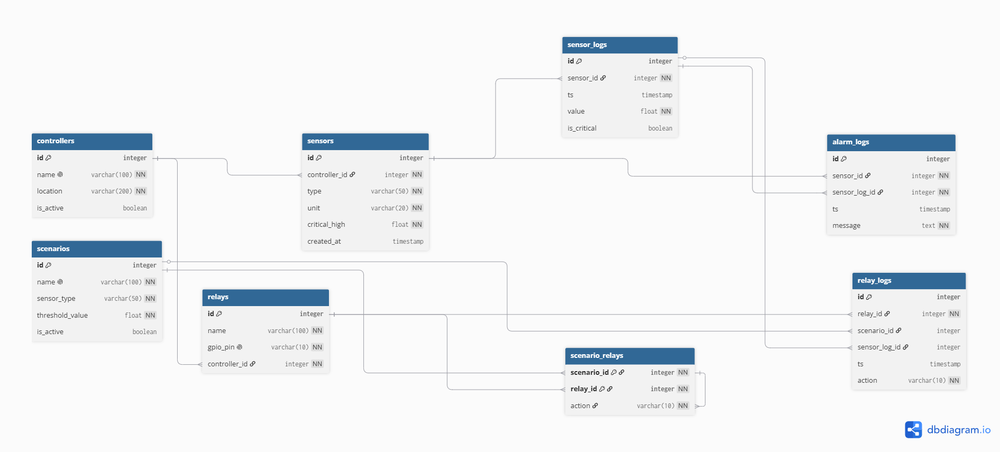

# Расчетно-графическая работа

## Проектирование и реализация БД

**Выполнили:** студенты группы ИКС-433  Синица М. А. и Кутенков А.
**Тема:** IoT-платформа управления умным домом и телеметрии датчиков

---

## Цель работы

1. Спроектировать авторскую реляционную базу данных по тематике, связанной с телекоммуникационными технологиями или IT-индустрией.

2. Реализовать спроектированную схему в СУБД PostgreSQL с использованием структурированного SQL-скрипта.

3. Визуализировать логическую структуру БД в виде диаграммы (ER-модели).

4. Разработать комплексный набор SQL-запросов, демонстрирующих функциональные возможности и аналитический потенциал созданной системы.

---

## Градация оценки

### Задания на «удовлетворительно»

|Требование|Статус|
|---|---|
|Выбрать тему в сфере Telecom/IT и написать описание предметной области (0.5–1 стр.)|✅|
|Разработать схему БД из 5+ логически связанных таблиц|✅ (8 таблиц)|
|Написать скрипт schema.sql с командами CREATE TABLE|✅|
|Определить PRIMARY KEY для каждой таблицы|✅|
|Добавить минимум 3 внешних ключа (FOREIGN KEY)|✅ (7 FK)|
|Создать ER-диаграмму и сохранить её (diagram.png/pdf)|✅|
|Наполнить БД тестовыми данными (скрипт INSERT)|✅|
|Написать 10+ SQL-запросов: SELECT, WHERE, JOIN, GROUP BY|✅ (20 запросов)|
|Оформить README.md с описанием проекта и инструкцией|✅|

### Задания на «хорошо»

|Требование|Статус|
|---|---|
|Расширить схему БД до 7+ логически связанных таблиц|✅ (8 таблиц)|
|Добавить ограничения NOT NULL для обязательных атрибутов|✅|
|Добавить ограничения UNIQUE для уникальных полей|✅|
|Добавить минимум 2 ограничения CHECK|✅|
|Создать минимум 2 индекса (CREATE INDEX)|✅ (2 индекса)|
|Добавить в запросы минимум 1 с HAVING|✅|
|Добавить минимум 1 запрос с подзапросом или CTE|✅|
|Добавить минимум 1 запрос с ORDER BY ... LIMIT|✅|
|Дополнить README.md обоснованием выбора ограничений и индексов|✅|
|Обновить schema.sql с учётом всех ограничений и индексов|✅|

### Задания на «отлично» (Вариант В)

|Требование|Статус|
|---|---|
|Разработать минимум 2 хранимые функции на PL/pgSQL|✅ (2 функции)|
|Реализовать минимум 1 триггер (аудит, автообновление, бизнес-правила)|✅ (1 триггер)|
|Написать сценарий демонстрации работы функций и триггера (demo.sql)|✅|

---

## Краткое описание проекта

### Тема проекта

IoT-платформа управления умным домом и телеметрии датчиков

### Назначение

База данных предназначена для централизованного сбора, хранения и анализа данных с датчиков умного дома. Система позволяет:

- Регистрировать контроллеры и подключённые к ним датчики
- Фиксировать показания датчиков в реальном времени
- Автоматически обнаруживать критические отклонения (задымление, протечка, перегрев)
- Выполнять сценарии автоматизации (включение вентиляции, сирены, охлаждения)
- Вести полный журнал аварий и срабатываний исполнительных устройств

### Основные сущности и их роль

| Сущность                                 | Назначение                                                                       |
| ---------------------------------------- | -------------------------------------------------------------------------------- |
| controllers (контроллеры)                | Центральные хабы (Raspberry Pi), собирающие данные с датчиков и управляющие реле |
| sensors (датчики)                        | Измерительные устройства: температура, влажность, CO2, дым, протечка             |
| sensor_logs (логи)                       | Временной ряд показаний от каждого датчика                                       |
| scenarios (сценарии)                     | Правила автоматизации: «если датчик  превысил порог , выполнить действие »       |
| relays (реле)                            | Исполнительные устройства: вентиляция, сирена, кондиционер                       |
| scenario_relays (связь сценариев и реле) | Многие к многим связь: один сценарий управляет несколькими реле                  |
| relay_logs (журнал реле)                 | История срабатываний исполнительных устройств                                    |
| alarm_logs (журнал аварий)               | Автоматическая запись критических инцидентов (дым, протечка)                     |

### Ключевые возможности

- Контроль критических порогов для каждого датчика
- Автоматическое обнаружение превышения порогов через триггер
- Генерация аварий для датчиков дыма и протечки
- Выполнение сценариев автоматизации при критических показаниях
- Полный аудит всех срабатываний реле и аварийных событий
- Каскадное удаление связанных данных при удалении контроллера

---

## Индексы

|№|Таблица|Индекс|Колонка|Назначение|
|---|---|---|---|---|
|1|sensor_logs|idx_sensor_logs_ts|(sensor_id, ts DESC)|Ускорение построения графиков телеметрии и выборок по времени|
|2|sensor_logs|idx_sensor_logs_only_critical|is_critical (частичный)|Мгновенный доступ к критическим событиям без сканирования всех логов|

---

## Обоснование ограничений

| Ограничение                     | Где                                                                                                       | Зачем                                                                     |
| ------------------------------- | --------------------------------------------------------------------------------------------------------- | ------------------------------------------------------------------------- |
| PRIMARY KEY                     | Все таблицы                                                                                               | Уникальная идентификация каждой записи                                    |
| FOREIGN KEY                     | sensors, sensor_logs, relays, scenario_relays, relay_logs, alarm_logs                                     | Защита от ссылок на несуществующие объекты, поддержка каскадного удаления |
| NOT NULL                        | name, location, type, unit, critical_high, value, action, message                                         | Обязательность бизнес-полей                                               |
| UNIQUE                          | [controllers.name](https://controllers.name/), [scenarios.name](https://scenarios.name/), relays.gpio_pin | Недопустимость дублирования имён контроллеров, сценариев и GPIO-пинов     |
| CHECK (type IN (...))           | sensors.type                                                                                              | Только допустимые типы датчиков                                           |
| CHECK (critical_high > 0)       | sensors.critical_high                                                                                     | Порог не может быть отрицательным                                         |
| CHECK (action IN ('ON', 'OFF')) | scenario_relays, relay_logs                                                                               | Только допустимые действия                                                |
| CHECK (gpio_pin > '')           | relays.gpio_pin                                                                                           | Формат GPIO-пина (не пустой)                                              |

---

## Обоснование индексов

Индексы добавлены для оптимизации наиболее частых операций:

1. **idx_sensor_logs_ts (sensor_id, ts DESC)** -ускоряет запросы получения последних показаний конкретного датчика, что критически важно для построения графиков в реальном времени

2. **idx_sensor_logs_only_critical (WHERE is_critical = TRUE)** -  индекс, который занимает мало места и обеспечивает мгновенный доступ ко всем критическим показаниям, что ускоряет запросы поиска аварийных событий

---

## Инструкция по проверке

### Требования

- PostgreSQL 13+
- psql или DBeaver/pgAdmin
# 1. Создание базы данных
createdb iot_smart_home
# 2. Выполнение скриптов по порядку
psql -d iot_smart_home -f schema.sql
psql -d iot_smart_home -f data.sql
psql -d iot_smart_home -f queries.sql
psql -d iot_smart_home -f demo.sql

---

## Структура проекта

|Файл|Назначение|
|---|---|
|schema.sql|Создание таблиц, индексов, функций и триггера|
|data.sql|Тестовые данные (35+ записей)|
|queries.sql|20 аналитических SQL-запросов|
|demo.sql|Демонстрация работы триггера и функций|
|diagram.png|ER-диаграмма логической структуры БД|
|README.md|Описание проекта и инструкция по проверке|

---

## Тестовые данные

Скрипт `data.sql` добавляет следующие тестовые записи:

|Таблица|Количество записей|
|---|---|
|controllers|2|
|sensors|3|
|relays|3|
|scenarios|2|
|scenario_relays|3|
|sensor_logs|6 (включая критическое показание)|
|relay_logs|(создаются триггером)|
|alarm_logs|(создаются триггером)|

**Итого суммарно по всем таблицам:** более 30 записей

---

## Демонстрация работы триггера и функций

Сценарий `demo.sql` автоматически:

1. Показывает текущее состояние системы
2. Вставляет критическое показание датчика дыма (85.0 ppm при пороге 50.0)
3. Проверяет, что триггер создал запись в `alarm_logs`
4. Проверяет, что триггер выполнил сценарий и включил связанные реле (вентиляция, сирена)
5. Демонстрирует работу хранимых функций:
    - `get_active_alarms_count()` - подсчёт аварий за последний час

## Графическая модель данных (ER-диаграмма)

